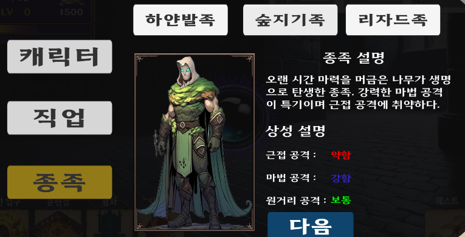
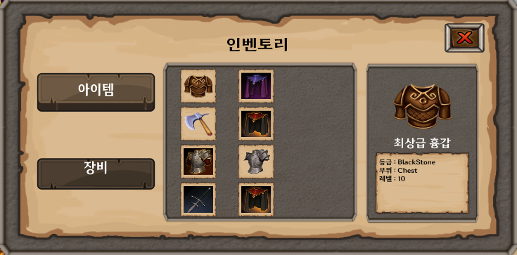

# Dungeon_Raising

### SPUM 기반 2D 픽셀아트와 레트로 스타일을 살린 모바일 판타지 RPG 게임입니다.

# 개발 기간
### 2025.01 ~ 2025.04

# 장르
### 모바일 / 판타지 / RPG / 방치형

# 다운로드
### 2024.04 **Google Play** 출시 예정

# 사용 기술
- **Engine** : 
- **Language** : 
- **Framework** : 
- **VCS** :  
- **3rd Party Library / SDK**
    - **SPUM**(2D 캐릭터 제작)
    - **뒤끝**(비속어 필터링 / 클라우드 / 네트워킹 관련)
    - **DOTWeen**(애니메이션 / 스크립팅)
- **Art** : **Leonardo AI**(게임 내 모든 스프라이트 리소스 제작)
    
# 게임 소개 (개발 진행 중인 사진입니다.)
- **거꾸로 솟은 50층의 타워에 갇힌 플레이어는 각 층의 던전을 정복해 나가며 자신만의 던전을 키워갑니다.**

- 원하는 **성별** / **직업**을 선택하고, 같이 던전을 키워나갈 **파트너 종족**을 선택합니다.

### 남성 검사 | 남성 궁수 | 여성 궁수 | 여성 마법사

- 선택한 파트너 종족은 **영웅**으로 불리며, 게임 내 재화를 소비하여 새로운 영웅을 소환할 수 있습니다.

- **1층부터 50층까지의 던전을 정복**하며, 던전의 원래 주인들을 사냥하고 자신만의 던전을 키워야 합니다.

- **광산**, **대장간** 등의 시설에서 재화를 획득하고, 아이템을 강화 / 승급할 수 있습니다.

- 플레이어와 영웅이 보유한 장비는 **인벤토리**에서 확인할 수 있습니다.

- **일일 퀘스트**와 **주간 퀘스트**를 통해 각종 보상을 획득할 수 있습니다.

- 플레이어의 던전에 존재하는 **왕좌**를 통해 영웅을 관리할 수 있습니다.

- 메인 화면에서 **소환 구슬** 을 클릭하여 **새로운 영웅**을 소환할 수 있습니다.

